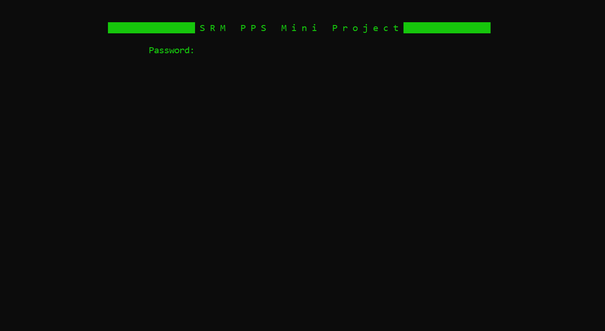
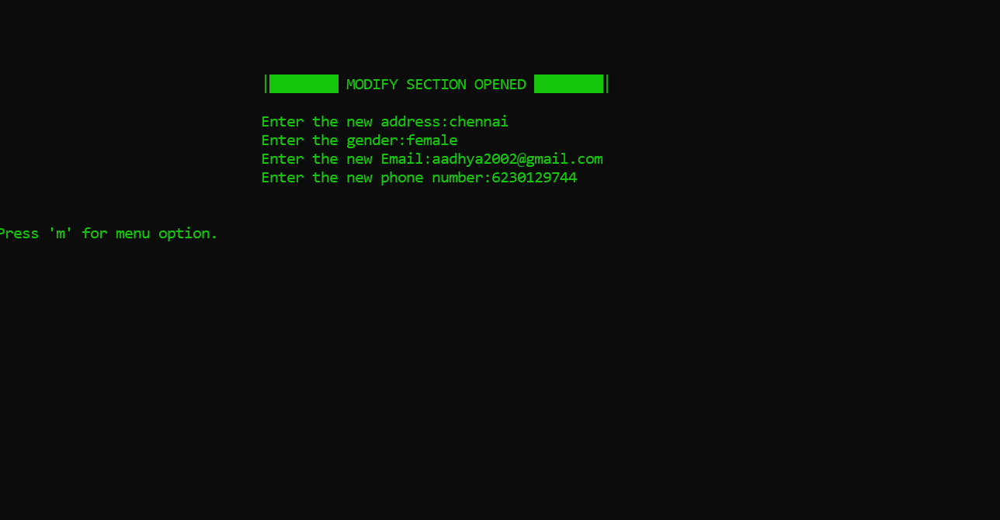

<div align="center">
<h1> Programming For Problem Solving </h1>
</div>

***
# SECURE PHONEBOOK 📞 
> This project is made with C language. It is a Secure Phonebook which encrypts your contacts with a password. 



```bash
password: tiaraizada
```

## Features 

  <table>
  <tr>
  <th> <h3> Feature </h3> </th>
  <th> <h3> Preview </h3> </th>
  <tr>
  <td> Main Menu </td>
  <td>  </td>
  </tr>
  <tr> 
  <td> Add New Contact </td>
  <td>  </td>
  </tr>
  <tr>
  <td> Search Contact </td>
  <td>  </td>
  </tr>
  <tr> 
  <td> List Contacts </td>
  <td>  </td>
  </tr>
  <tr> 
  <td> Modify Existing Contact </td>
  <td>  </td>
  </tr>
  <tr>
  <td> Delete Contact </td>
  <td>  </td>
  </tr>
  </table>

## [Check out the code here](https://github.com/tiaraizada/PHONE-BOOK-PPS-) 

<h2>📬 Contact</h2>

If you want to contact me, you can reach me through below handle.

 <a href="https://github.com/tiaraizada/PHONE-BOOK-PPS-"> &nbsp; Tia Raizada </img></a>